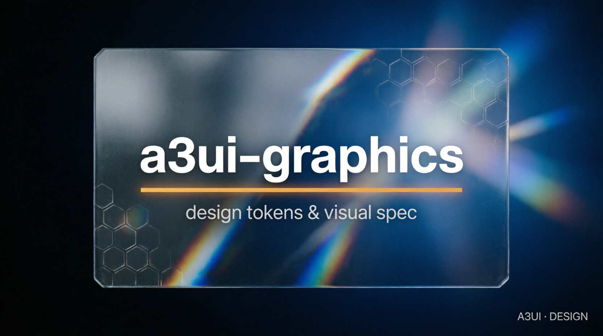

# a3ui-graphics — renderer-neutral visual tokens



A renderer-neutral specification of visual tokens, schemas, rationale, limits, and implementation phases for A3UI consumers.

[](LICENSE) [](https://github.com/valeriobitzone-png/a3ui-graphics/tags) [](https://github.com/valeriobitzone-png/a3ui-graphics/actions/workflows/ci.yml)

## What it is

`manifest.json` is the machine-readable index; only entries marked `consumabile: true` in phase 1 may be consumed. The repository documents token schemas, rationale, limits, and deferred phases.

## What it is NOT

It is not application code, not a second A3UI renderer, not a source of epistemic facts, and not permission to consume deferred phases.

## Status

- **VERIFIED:** GS-001..GS-004 and CS-001..CS-006, token/schema consistency, manifest alignment, and phase-1 boundaries.
- **UNVERIFIED:** downstream visual fidelity and hardware-specific rendering.

## Quickstart

### Get it

```bash
git clone https://github.com/valeriobitzone-png/a3ui-graphics.git
cd a3ui-graphics
# Requirements: Python 3
```

### Prove it

```bash
python3 tests/gs_test.py
python3 tests/consumer_test.py
```

### Integrate it

Read `manifest.json`, consume only phase-1 entries, preserve tag/version/path provenance, and validate with `tools/valida_token.py` in your consumer repository when available. Never glob tokens or silently consume deferred phases.

## Architecture

`manifest.json` indexes `tokens/`; `schemas/` validates them; `docs/` records rationale and phase boundaries; `tests/` checks producer and consumer contracts.

## Testing & conformance

CI runs the graphics schema and consumer gates. Phase-1 entries currently cover colors, elevation, and surfaces; motion, typography, audio, and haptic remain deferred.

## Family

- [a3](https://github.com/valeriobitzone-png/a3) — normative specs and Kotlin implementation
- [a3-ts](https://github.com/valeriobitzone-png/a3-ts) — TypeScript reference implementation
- [a3-go](https://github.com/valeriobitzone-png/a3-go) — Go reference implementation
- [a3ui-web](https://github.com/valeriobitzone-png/a3ui-web) — Web Components renderer
- [a3ui-cli](https://github.com/valeriobitzone-png/a3ui-cli) — textual Python renderer

## Contributing

Keep manifest, schema, token, and phase declarations synchronized. Do not promote a deferred token without tests and provenance.

## License

Specification, token, schema, and documentation assets are CC BY 4.0 (`LICENSE`).

## Provenance

Measured: schema checks, manifest alignment, phase checks, and consumer tests. Visual quality on a particular device remains unverified until measured there.
